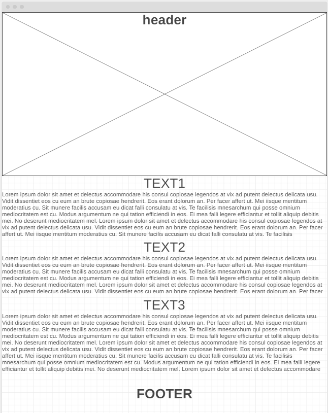
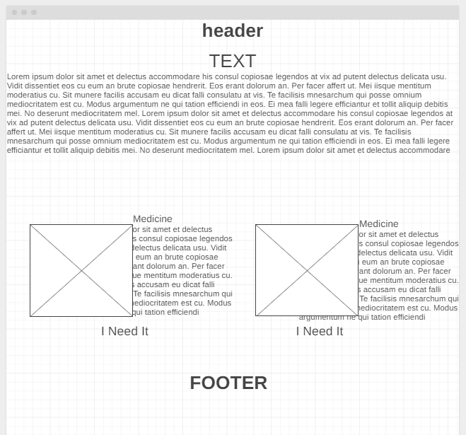
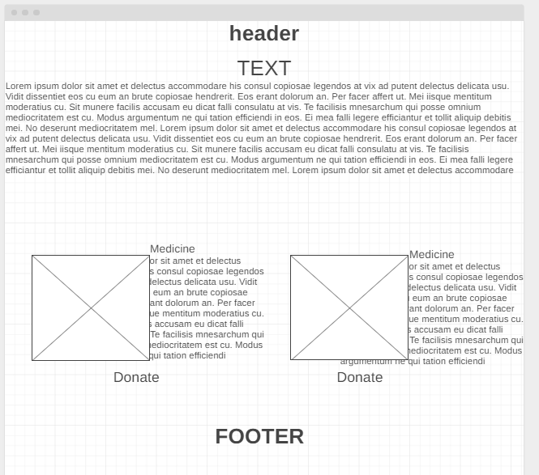
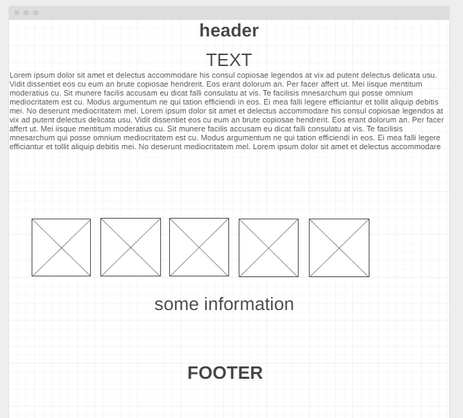
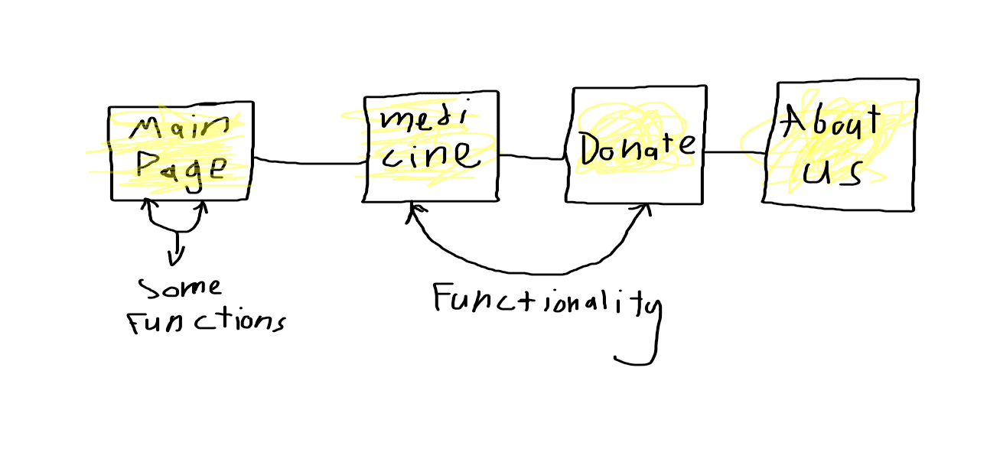

# The Free Health Is Right For Everyone

### Ibn-Sina Team members
1. ***Ishaq Alathamneh***
1. **Aya Azzam**
1. **Mohammad Momani**
1. **Alaa Hamdan**
1. **Naeem Musameh**

### Description:
**Our project revolves around helping patients who cannot afford the cost of their medication, as there are many expensive medicines and it is possible through our page to help from the whole world They can donate an amount to buy the medicine or donate the medicine itself.**

### User Stories 

1. As a user I want to see website's name and some definition of website's goals and funding resources. 
1. As a user I want to see some nice style that giving a comforte for me.
1. As a user I want to see a readable font size and family.
1. As a user I want to use some functionality that make the experiement easier.
1. As a user I want to see all medicines in medicine page and when I chose any medicine save the medicine to the order list to show these list in donate page.
1. As a user I want to see header that contain all pages and some information about the development team.

### Wireframes 
1. Main Page: .
1. Medicine: .
1. Donate: .
1. About Us: .

### Domain modeling
